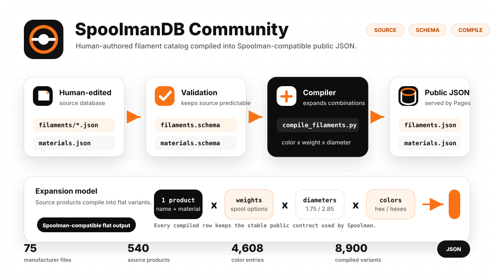
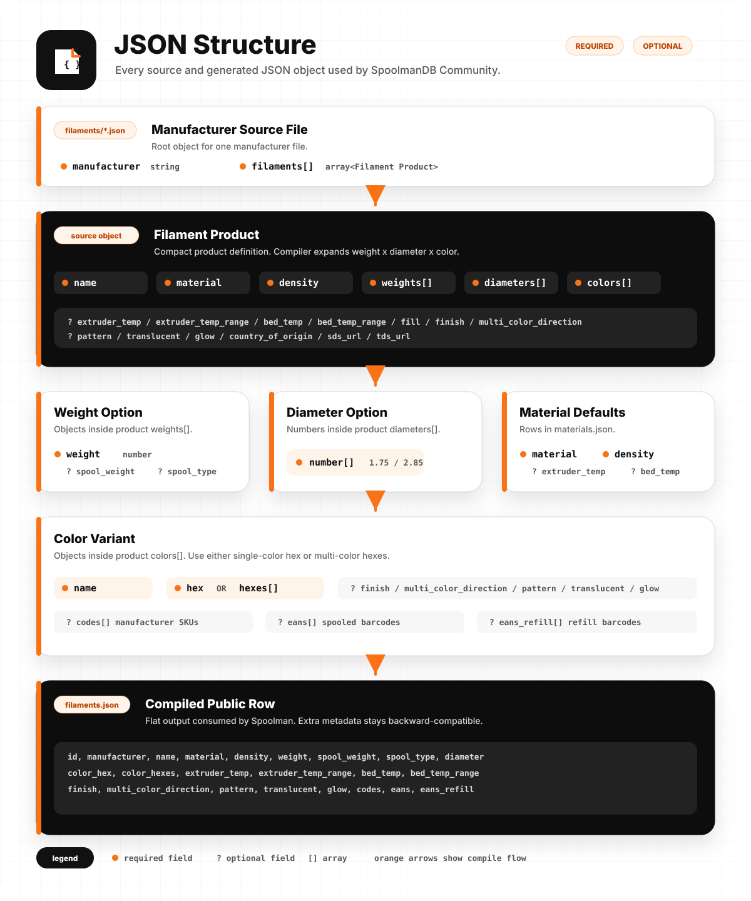
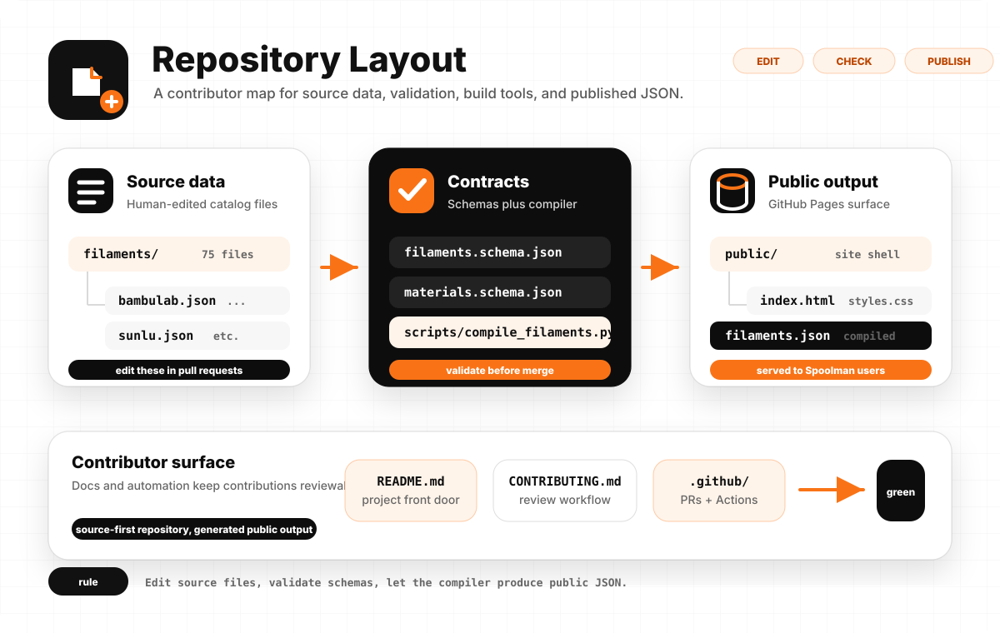

<h1 align="center">SpoolmanDB Community</h1>

<p align="center">
  Community-maintained filament and materials data for 3D printing.
</p>

<p align="center">
  <a href="https://github.com/Icezaza2543/SpoolmanDB-Community/actions/workflows/build.yml"></a>
  <a href="https://icezaza2543.github.io/SpoolmanDB-Community/"></a>
  <a href="LICENSE"></a>
  <a href="TERMS.md"></a>
  <a href="POLICY.md"></a>
  <a href="CONTRIBUTING.md"></a>
  <a href="https://github.com/Donkie/SpoolmanDB"></a>
</p>

<p align="center">
  <code>filaments.json</code> | <code>materials.json</code> | schema-validated source data
</p>

---

## Project Status

* **Project status**: MAINTENANCE MODE
* **Published records**: 51,734
* **P0/P1**: Complete
* **P2/P3**: Complete
* **Backlog location**: [docs/coverage-backlog.md](docs/coverage-backlog.md)
* **Maintenance guide**: [docs/maintenance.md](docs/maintenance.md)

## What this is

SpoolmanDB Community is an actively maintained community extension of SpoolmanDB, focused on faster filament updates, provenance, data quality, public-ID stability, and compatibility with the actively developed Spoolman application.

### Upstream Relationships & Positioning

* **Active Application Upstream**: [Donkie/Spoolman](https://github.com/Donkie/Spoolman) — The actively developed application server that consumes external filament data via its `ExternalFilament` contract (`spoolman/externaldb.py`).
* **Original Data Upstream**: [Donkie/SpoolmanDB](https://github.com/Donkie/SpoolmanDB) — The original upstream static dataset. Repository activity resumed in August 2026 with contributor tooling and catalog-preview automation; Community remains independently maintained while upstream data PRs are reviewed on their own timeline.
* **SpoolmanDB-Community Position**: An independent community extension and staging-quality dataset. It is **not** a replacement application fork, but a community-driven database maintaining strict quality controls, public-ID stability, and rich metadata extensions.
* **Contract Compatibility**: Compatible with Spoolman's pinned stable release (`v0.25.0`) and monitored against the `master` canary. See the detailed [Upstream Compatibility & Divergence Tracker](docs/UPSTREAM_COMPATIBILITY.md).
* **Public ID Stability**: Every published filament record is protected by an automated PR-base baseline stability gate (`contracts/compiled_id_baseline.json`) ensuring historical IDs never disappear or change accidentally.
* **Community Extensions**: Metadata such as Country of Origin (COO), SDS/TDS document links, manufacturer article codes, and EAN/GTIN barcodes are maintained as Community extensions.

## Key Enhancements & Differences from Upstream

SpoolmanDB Community introduces several structural, validation, and metadata improvements over the original `Donkie/SpoolmanDB` project:

*   **Native & Strict Quality Controls**:
    *   **Unified Validation**: Uses a native Python validation script ([validate.py](scripts/validate.py)) powered by `jsonschema` instead of relying on external CLI tools.
    *   **Rigid Compiler Checks**: A compiled schema ([filaments.compiled.schema.json](filaments.compiled.schema.json)) strictly validates the final compiled database to prevent broken data structures, bad IDs, or invalid formats from shipping.
    *   **Unit Test Suite**: Includes automated compiler unit testing using `pytest` ([test_compile.py](tests/test_compile.py)) to safeguard ID normalization, multi-color constraints, and manufacturer duplicate checks.
*   **Editor Experience**:
    *   Workspace configurations ([settings.json](.vscode/settings.json)) bind schemas to JSON files in the IDE, offering real-time diagnostics, autocomplete, and inline linting.
*   **Expanded Data & Metadata**:
    *   **Additional Metadata**: Full compiler passthrough for source-backed fields including `country_of_origin`, `sds_url`, `tds_url`, `codes`, `eans`, and `eans_refill` from source profiles to the final database.
    *   **Modern Materials**: Added missing material definitions in [materials.json](materials.json) (`BVOH`, `CoPE`, `PP`, `PAHT`, `PPA`, `PPS`, `PET`).
    *   **Massive Brand Updates**: Broad coverage of popular consumer, local, industrial, and community brands such as Bambu Lab, Polymaker, Spectrum, Threebees, Filamax, ProtoFil, Cubic3, and more.
    *   **ASEAN & Local-Market Coverage**: Source-backed local filament data across Thailand, Malaysia, Singapore, Indonesia, Vietnam, and the Philippines, with current totals generated in the snapshot below.
    *   **Refill & Spool Type Support**: Source data can preserve `plastic`, `cardboard`, `metal`, legacy `refill`, and legacy `unknow` evidence. The published Spoolman contract emits only `plastic`, `cardboard`, `metal`, or `null`, with refill packaging preserved separately as `is_refill`.

## Live data

| Resource | Link |
| --- | --- |
| Browse the database | <https://icezaza2543.github.io/SpoolmanDB-Community/> |
| Compiled filament data | <https://icezaza2543.github.io/SpoolmanDB-Community/filaments.json> |
| Compiled filament schema | <https://icezaza2543.github.io/SpoolmanDB-Community/filaments.compiled.schema.json> |
| Material defaults | <https://icezaza2543.github.io/SpoolmanDB-Community/materials.json> |
| Contributing guide | [CONTRIBUTING.md](CONTRIBUTING.md) |
| Terms of use | [TERMS.md](TERMS.md) |
| Project policy | [POLICY.md](POLICY.md) |
| Upstream project | [Donkie/SpoolmanDB](https://github.com/Donkie/SpoolmanDB) |

## Current snapshot

<!-- readme-snapshot:start -->
| Source | Count |
| --- | ---: |
| Manufacturer source files | 490 |
| Material definitions | 154 |
| Source filament objects | 9,945 |
| Color entries | 33,562 |
| Compiled filament variants | 51,734 |
| Source filaments with country of origin | 7,346 |
| Source filaments with TDS/product links | 4,574 |
| Source filaments with SDS links | 1,012 |
| Manufacturer product code/ID entries | 11,891 |
| EAN/GTIN entries | 2,194 |
| ASEAN manufacturer coverage | 24 brands / 147 source filaments |

Counts in this block are generated from the current repository state. Run `python scripts/readme_snapshot.py --write` after source-data changes. The compiled variant count expands source data across color, diameter, weight, and spool combinations.

### Spool metadata snapshot

| Source weight metadata | Entries |
| --- | ---: |
| `spool_type: plastic` | 8,060 |
| `spool_type: cardboard` | 2,490 |
| `spool_type: metal` | 0 |
| `spool_type: refill` (legacy) | 235 |
| `spool_type: unknow` (legacy) | 26 |
| `spool_type: null` | 0 |
| `spool_type` omitted | 310 |
| Effective refill (`is_refill: true` or legacy `spool_type: refill`) | 256 |
<!-- readme-snapshot:end -->

ASEAN coverage uses the curated [ASEAN manufacturer registry](scripts/asean_manufacturers.json); it is never inferred from `country_of_origin`, which records manufacturing origin rather than brand location.

The source database intentionally preserves the historical `unknow` spelling for ID and curation stability. New spool values should be evidence-backed; do not infer spool material from vague marketing phrases alone. New refill entries should use `is_refill: true`; the legacy source value `spool_type: "refill"` remains accepted so existing IDs do not change.

### Spoolman compatibility contract

`spool_type` in the published `filaments.json` describes physical spool material and is restricted to the values accepted by Spoolman. Community-only refill metadata is emitted as the additional boolean `is_refill`. The public Community JSON and Explorer retain that distinction; current Spoolman accepts the extra field but drops it when serializing data into its own cache.

| Source weight metadata | Published `spool_type` | Published `is_refill` |
| --- | --- | ---: |
| `plastic`, `cardboard`, or `metal` | same value | `false` |
| legacy `refill` or `is_refill: true` | `null` | `true` |
| legacy `unknow`, `null`, or omitted | `null` | `false` |

Compatibility is checked in three layers:

1. Compiler normalization uses an explicit allowlist and preserves historical ID suffixes.
2. The compiled schema rejects values outside Spoolman's public enum.
3. Normal builds validate every record against a **required stable pin** of Spoolman's `ExternalFilament` contract. Version and commit are defined only in [`contracts/spoolman_upstream.json`](contracts/spoolman_upstream.json). CI uses the reviewed offline snapshot [`contracts/spoolman_externaldb.py`](contracts/spoolman_externaldb.py) so merge checks are deterministic and network-free. Details: [docs/spoolman-compatibility.md](docs/spoolman-compatibility.md).

A separate **canary** check fetches current `Donkie/Spoolman:master`, validates against it, and reports exactly which `ExternalFilament` fields or types changed relative to the stable pin. Canary failures are visible in CI (job summary + warning) but **do not block data PRs**. The weekly [Spoolman compatibility workflow](.github/workflows/spoolman-compatibility.yml) also runs **pin integrity** (`--mode verify-pin`): it fetches the configured stable commit and asserts the local snapshot still matches, without changing offline PR CI.

## Data model at a glance

<picture>
  <source media="(prefers-color-scheme: dark)" srcset="docs/assets/data-model-dark.svg">
  
</picture>

Source files stay small enough to review by hand. The compiler validates and expands them into the flat JSON contract consumed by Spoolman.

### JSON schema map

<picture>
  <source media="(prefers-color-scheme: dark)" srcset="docs/assets/json-structure-dark.svg">
  
</picture>

## Repository layout

```text
filaments/                 Manufacturer source JSON files
materials.json             Shared material defaults
filaments.schema.json      Schema for manufacturer source files
materials.schema.json      Schema for material defaults
scripts/
  compile_filaments.py      Compile source data into public JSON
  readme_snapshot.py        Generate/check README repository metrics
  asean_manufacturers.json  Curated ASEAN brand-location registry
public/                    GitHub Pages shell and deployed data target
```

<picture>
  <source media="(prefers-color-scheme: dark)" srcset="docs/assets/repository-layout-dark.svg">
  
</picture>

## Contributor workflow

1. Add or edit manufacturer source files in `filaments/`.
2. Keep the pull request focused: one manufacturer, one correction set, or one schema change.
3. Link manufacturer product pages, datasheets, SDS/TDS files, or other evidence.
4. Run validation and tests locally before opening a pull request.

First install developer dependencies:

```powershell
pip install -r requirements-dev.txt
```

Then compile, validate, and test:

```powershell
python scripts/readme_snapshot.py --write
python scripts/compile_filaments.py
python scripts/validate.py
python -m pytest -q
python scripts/check_spoolman_compat.py --mode stable
# Optional advisory check against Donkie/Spoolman master (does not block merge):
python scripts/check_spoolman_compat.py --mode canary
```

## Data model

The source files in `filaments/` are intentionally compact. Deployment expands them into one generated `filaments.json` file. If a source entry has two diameters, two spool weights, and five colors, it becomes twenty compiled filament variants.

<details>
<summary>Filament source fields</summary>

| Field | Required | Notes |
| --- | --- | --- |
| `name` | yes | Product or product-line name. Usually contains `{color_name}` so each color expands into a readable compiled name. Follow manufacturer naming; do not add `material` here unless it is part of the official product name. |
| `material` | yes | Authoritative material code, such as `PLA`, `PETG`, `ABS`, `TPU-95A`, or schema-supported composites. |
| `density` | yes | Material density in g/cm3. |
| `weights` | yes | Array of `weight`, optional `spool_weight`, optional physical `spool_type`, and optional `is_refill`. Prefer `is_refill: true` for spoolless products; legacy `spool_type: "refill"` remains accepted for ID stability. |
| `diameters` | yes | Filament diameters in mm, commonly `1.75` or `2.85`. |
| `colors` | yes | Color objects with `name` plus either `hex` or `hexes`. |
| `extruder_temp` | optional | Recommended extruder temperature in degrees Celsius. |
| `extruder_temp_range` | optional | Two-value temperature range, such as `[190, 230]`. |
| `bed_temp` | optional | Recommended bed temperature in degrees Celsius. |
| `bed_temp_range` | optional | Two-value bed temperature range. |
| `finish` | optional | `matte` or `glossy`; only set when the product is designed that way. |
| `multi_color_direction` | optional | `coaxial` for split/side-by-side colors or `longitudinal` for color changes along the filament length. |
| `pattern` | optional | Currently `marble` or `sparkle`. |
| `translucent` | optional | Boolean for partially see-through filament. |
| `glow` | optional | Boolean for glow-in-the-dark filament. |
| `country_of_origin` | optional | Manufacturing country as ISO 3166-1 alpha-2 (`US`, `CN`, `DE`, …). Full names and non-ISO strings are rejected. |
| `sds_url` | optional | Safety Data Sheet URL. |
| `tds_url` | optional | Technical Data Sheet URL. |

Color entries can override `finish`, `multi_color_direction`, `pattern`, `translucent`, and `glow` when a specific color differs from the product default. They can also include `codes`, `eans`, and `eans_refill` arrays for manufacturer product codes, SKUs, or platform variant IDs and spooled/refill EAN or GTIN barcodes.

### Display names and upstream compatibility

Compiled `name` values stay upstream-compatible with [Donkie/SpoolmanDB](https://github.com/Donkie/SpoolmanDB): the compiler expands the source template and color only. `material` remains a separate field.

The Community Explorer may compose `material + name` for display and search when the product name does not already contain the material as its own token. For example, `name: "Plus BLACK"` with `material: "ABS"` is stored as-is in `filaments.json`, while Explorer shows `ABS Plus BLACK`.

`python scripts/validate.py` prints non-blocking `WARN display-name` hints for ambiguous templates. Use `--strict-display-names` only when you want that check to fail validation.

</details>

<details>
<summary>Material source fields</summary>

All shared material defaults live in `materials.json`.

| Field | Required | Notes |
| --- | --- | --- |
| `material` | yes | Material name, such as `PLA`. |
| `density` | yes | Density in g/cm3. |
| `extruder_temp` | optional | General extruder temperature. |
| `bed_temp` | optional | General bed temperature. |

</details>

## Maintenance stance

Owner-approved duplicate migrations are recorded in the [retired-ID registry](contracts/retired_ids.json). The tooling retires no data automatically. Each approved true-duplicate migration intentionally removes its listed IDs from the catalog: existing Spoolman spools keep their local imported data, but Spoolman does not read the registry, redirect old catalog lookups or migrate stored external IDs. Other consumers must apply the old-to-survivor mapping themselves. See the [review, ID-safety and exact-reinstatement rules](docs/maintenance.md#4-public-id-immutability-rule).

### Kingroon duplicate migration (2026-10-03)

This is an **intentional breaking catalog migration** approved by the owner for [issue #66](https://github.com/Icezaza2543/SpoolmanDB-Community/issues/66). It retires exactly five duplicate records, reducing the compiled catalog from 53,434 to 53,429 records without creating replacement IDs. Each survivor already exists, and its identity and metadata are unchanged.

| Retired public ID | Existing survivor public ID |
| --- | --- |
| `kingroon_pla_kingroonplablack_1000_175_p` | `kingroon_pla_plablack_1000_175_p` |
| `kingroon_petg_kingroonpetgblack_1000_175_p` | `kingroon_petg_petgblack_1000_175_p` |
| `kingroon_petg_kingroonpetggrey_1000_175_p` | `kingroon_petg_petggray_1000_175_p` |
| `kingroon_pla_kingroonplawhite_1000_175_p` | `kingroon_pla_plawhite_1000_175_p` |
| `kingroon_petg_kingroonpetgwhite_1000_175_p` | `kingroon_petg_petgwhite_1000_175_p` |

PETG Basic remains a separate family: all ten of its records are untouched. The unique `Kingroon PLA` Grey, Red and Blue records retain their original IDs and metadata, as do all refill variants. No other brand is included.

The [reviewed decisions and original audit](docs/audits/2026-10-03-kingroon-duplicate-review.json) retain unresolved conflicts: PLA Black/White density 1.23 versus 1.24 g/cm³ and nozzle 190–210 versus 190–230 °C; PETG White HEX `FFFFFF` versus `F5F5F5`. Survivor values are kept. The official PLA Basic page and general filament guide are not yet bound to these historical variants or their production lots, so they do not authorize changing those values. The registry preserves each retired record's exact original baseline key for audit and exact reinstatement.

### Nebula duplicate migration (2026-10-03)

This is an **intentional breaking catalog migration** approved for groups N001–N345. It retires 345 matched OFD `PLA Premium` / `PETG Premium` records, reducing the compiled catalog from 53,429 to 53,084 and Nebula from 1,623 to 1,278 records. The existing `Premium PLA` / `Premium PETG` IDs survive by Rule 3, following Nebula's official `PREMIUM PLA` / `PREMIUM PET-G` product names; Cartesian record counts do not decide the direction. No new IDs are created, and all survivor and unique identities and metadata stay unchanged.

The [complete list of 345 retired IDs and their survivors](docs/audits/2026-10-03-nebula-duplicate-review.md#complete-approved-retired-id-list) and [reviewed JSON audit](docs/audits/2026-10-03-nebula-duplicate-review.json) retain each original baseline key, source record and unresolved conflict. All 773 Nebula SKU/code bindings are preserved. PETG page-versus-TDS ranges and PETG 5kg density/temperature conflicts remain unresolved; survivor values are kept because no matching newer-lot evidence establishes a correction.

All 505 non-matching or otherwise out-of-scope OFD variants remain untouched, including all 2.85mm and Silk records. No other brand is changed. Retired IDs disappear from catalog lookups; existing Spoolman spools keep their local imported data, but Spoolman does not read the registry, redirect those lookups or migrate stored external IDs. Other consumers must apply the old-to-survivor mapping themselves.

### Protopasta duplicate migration (2026-10-03)

This is an **intentional breaking catalog migration** approved for 38 groups. It retires 41 duplicate IDs, reducing the compiled catalog from 53,084 to 53,043 and Protopasta from 889 to 848 records. Existing upstream-preferred IDs survive by Rule 1; no new IDs or changed/rekeyed survivor identities are introduced. Existing Spoolman spools retain their local imported data, but old catalog lookups disappear and Spoolman does not follow the retired-ID registry automatically.

The [complete list of 41 retired IDs and their survivors](docs/audits/2026-10-03-protopasta-duplicate-review.md#complete-approved-retired-id-list) and [reviewed JSON audit](docs/audits/2026-10-03-protopasta-duplicate-review.json) retain exact original baseline keys, source templates, unresolved conflicts and the three approved Simply line/color bindings. All 234 Protopasta SKU/code bindings are preserved. P004/P009/P012/P016 remain deferred and untouched; packaging/spool/tare and all other brands are unchanged.

The owner also approved 19 printing-field corrections on nine PETG survivors using current official product-line evidence, plus eight wrong-document-link corrections on four survivors. P034/P041 use explicitly approved **family-level PETG/PETG-CF7 material-table evidence** (250°C at 12 mm³/s, 80°C plate), not a manufactured min/max range or production-lot claim. Their recycled density stays 1.24 g/cm³ unresolved. Static Dissipative PETG now links matching PETG-ESD TDS/SDS; wrong PLA/HTPLA links on the two recycled survivors were removed because exact RPET document coverage is not confirmed. See the audit for every old/new field and source.

### Bambu Lab duplicate migration (2026-10-03)

This is an **intentional breaking catalog migration** approved for 124 groups: 117 Rule 1 groups, five Rule 3 Dual Color groups, and B043/B044 with the official **Blue Grey** survivor name. It retires 124 duplicate IDs, reducing the catalog from 53,043 to 52,919 and Bambu Lab from 614 to 490 records. No new IDs or changed/rekeyed survivor identities are introduced. Existing Spoolman spools keep their local imported data, but retired catalog lookups disappear; Spoolman does not follow the registry automatically.

The [complete list of 124 retired IDs and existing survivors](docs/audits/2026-10-03-bambulab-duplicate-review.md#complete-approved-retired-id-list) and [reviewed JSON audit](docs/audits/2026-10-03-bambulab-duplicate-review.json) retain exact original baseline keys, source-definition locations/templates, conflicts and ten lossless Dual Color bindings; full source definitions remain available at the pinned audit base. Existing codes are transferred only to the 24 approved target IDs, with no identifier changes to other weights/refills: Bambu code bindings become 734 → 723 as redundant bindings collapse, while all 678 unique values are preserved. EAN and refill-EAN bindings remain 18 and three respectively.

The owner also approved 15 printing-field changes on ten survivors using current official TDS: Aero uses raw-filament density 1.21 g/cm³ for length calculation; PC nozzle is 260–280°C; PC FR density is 1.18 g/cm³; PVA nozzle is 220–250°C. Silk/Lite values and 20 non-case HEX/representation differences remain unresolved, retaining survivor values. All 366 out-of-scope Bambu records, packaging/spool/tare and other manufacturers are unchanged.

### Fillamentum duplicate migration (2026-10-03)

This is an **intentional breaking catalog migration** approved for F001–F120: 60 ASA and 60 PLA groups. It retires exactly 120 duplicate IDs, reducing the catalog from 52,919 to 52,799 and Fillamentum from 244 to 124 records. Existing upstream-preferred `Extrafill {color_name}` IDs survive by Rule 1; no new IDs or changed/rekeyed survivor identities are introduced. Existing Spoolman spools retain their imported local data, but retired catalog lookups disappear; Spoolman does not consume the registry or redirect those lookups automatically.

The [complete list of 120 retired IDs and existing survivors](docs/audits/2026-10-03-fillamentum-duplicate-review.md#complete-approved-retired-id-list) and [reviewed JSON audit](docs/audits/2026-10-03-fillamentum-duplicate-review.json) retain each byte-identical original baseline key, all four full source definitions, compiled records and official evidence. All survivor metadata is unchanged, including packaging/spool/tare; four unique PLA Lilac records and every other manufacturer's compiled data are untouched. Codes/EAN bindings and unique values remain zero, with no transfers or losses.

Temperature-profile, density-document and 210/230/250 g tare conflicts remain documented and unresolved; 16 HEX differences are case-only. The current shop confirms 41 matching weight/diameter/color combinations, not the entire historical Cartesian matrix. The remaining 79 groups are current-unconfirmed, not declared unavailable or removed as obsolete. This approval authorizes duplicate retirement only, not new 1 kg variants, name changes or packaging corrections.

### Devil Design duplicate migration (2026-10-03)

This is an **intentional breaking catalog migration** approved for 110 duplicate groups, excluding D031–D035. It retires exactly 110 IDs, reducing the catalog from 52,799 to 52,689 and Devil Design from 608 to 498 records; the registry grows from 635 to 745 entries. Existing upstream-preferred IDs survive by Rule 1. There are no new IDs or changed/rekeyed survivor identities, metadata updates, or SKU/EAN transfers or losses.

The [complete list of 110 retired IDs and existing survivors](docs/audits/2026-10-03-devildesign-duplicate-review.md#complete-approved-retired-id-list) and [reviewed JSON audit](docs/audits/2026-10-03-devildesign-duplicate-review.json) preserve original baseline keys, source definitions, compiled records, official evidence and unresolved conflicts. D031–D035 (Galaxy PETG line/color decomposition) remain deferred in the [running duplicate backlog](docs/audits/duplicate-backlog.md); all ten IDs and 378 other unique/out-of-scope Devil Design records are untouched. Survivor printing values, HEX, packaging and tare are retained.

Retired IDs disappear from the published catalog. Existing Spoolman spools retain their imported local data, but Spoolman does not read the registry, redirect old catalog lookups or migrate stored external IDs. Other consumers must follow the exact mappings themselves; rollback requires exact original-key reinstatement and baseline re-enrollment. This approval does not authorize retirement of Galaxy PETG, new variants, naming changes or packaging corrections.

### Paramount 3D duplicate migration (2026-10-03)

This is an **intentional breaking catalog migration** retiring 114 duplicate OFD IDs: the catalog decreases from 52,689 to 52,575 records, Paramount 3D from 266 to 152, and the registry grows from 745 to 859 entries. The owner-selected older, well-formed `Paramount 3D PLA/PETG/ABS/ASA` families survive; their prefixes are not renamed. Survivor/unique identities, metadata, packaging and tare are unchanged, with no new IDs or identifier transfers. All 109 SKU bindings and 108 unique SKU values remain.

The [exact retired IDs, survivors and original keys](docs/audits/2026-10-03-paramount3d-duplicate-review.md#complete-approved-retired-id-list) and [reviewed JSON audit](docs/audits/2026-10-03-paramount3d-duplicate-review.json) record the explicit owner-pattern override and unresolved metadata. PM070 (Matte Black) and prefix cleanup remain in the [backlog](docs/audits/duplicate-backlog.md). Existing Spoolman spools keep local imported data, but Spoolman does not consume the registry or redirect retired external lookups.

This fork exists to keep the data usable through an independent community maintenance process. Upstream activity is monitored, and suitable changes may be proposed back to the original project only through an explicit contribution decision. This repository favors small reviewed data updates, source-backed corrections, schema validation, and GitHub Pages deployment that stays green.

### AzureFilm duplicate migration (2026-10-03)

This **intentional breaking catalog migration** retires 77 exact duplicate IDs in 77 reviewed groups: 52,575 → 52,498 catalog records, with 9 tooling/decomposition groups deferred. No new IDs or changed/rekeyed survivor/unique identities are introduced. Packaging and tare are unchanged.

The [complete mappings and conflicts](docs/audits/2026-10-03-azurefilm-duplicate-review.md#complete-approved-retired-id-list) and [reviewed JSON audit](docs/audits/2026-10-03-azurefilm-duplicate-review.json) retain each original baseline key, source definition and exact metadata/identifier decision. This commit lists 260 official-evidence printing/document field changes and 0 exact-target identifier transfers; unrelated variants are unchanged and unique identifier values are preserved. Existing Spoolman spools retain local data; Spoolman does not follow the retirement registry automatically.

### elegoo duplicate migration (2026-10-03)

This **intentional breaking catalog migration** retires 49 exact duplicate IDs in 49 reviewed groups: 52,498 → 52,449 catalog records, with 37 tooling/decomposition groups deferred. No new IDs or changed/rekeyed survivor/unique identities are introduced. Packaging and tare are unchanged.

The [complete mappings and conflicts](docs/audits/2026-10-03-elegoo-duplicate-review.md#complete-approved-retired-id-list) and [reviewed JSON audit](docs/audits/2026-10-03-elegoo-duplicate-review.json) retain each original baseline key, source definition and exact metadata/identifier decision. This commit lists 160 official-evidence printing/document field changes and 10 exact-target identifier transfers; unrelated variants are unchanged and unique identifier values are preserved. Existing Spoolman spools retain local data; Spoolman does not follow the retirement registry automatically.

### overture duplicate migration (2026-10-03)

This **intentional breaking catalog migration** retires 81 exact duplicate IDs in 81 reviewed groups: 52,449 → 52,368 catalog records, with 2 tooling/identity groups deferred. No new IDs or changed/rekeyed survivor/unique identities are introduced. Packaging and tare are unchanged.

The [complete mappings and conflicts](docs/audits/2026-10-03-overture-duplicate-review.md#complete-approved-retired-id-list) and [reviewed JSON audit](docs/audits/2026-10-03-overture-duplicate-review.json) retain each original baseline key, source definition and exact metadata/identifier decision. This commit lists 0 official-evidence printing/document field changes and 4 exact-target identifier transfers; unrelated variants are unchanged and unique identifier values are preserved. Existing Spoolman spools retain local data; Spoolman does not follow the retirement registry automatically.

### prusament duplicate migration (2026-10-03)

This **intentional breaking catalog migration** retires 74 exact duplicate IDs in 74 reviewed groups: 52,368 → 52,294 catalog records, with 1 tooling/identity groups deferred. No new IDs or changed/rekeyed survivor/unique identities are introduced. Packaging and tare are unchanged.

The [complete mappings and conflicts](docs/audits/2026-10-03-prusament-duplicate-review.md#complete-approved-retired-id-list) and [reviewed JSON audit](docs/audits/2026-10-03-prusament-duplicate-review.json) retain each original baseline key, source definition and exact metadata/identifier decision. This commit lists 116 official-evidence printing/document field changes and 0 exact-target identifier transfers; unrelated variants are unchanged and unique identifier values are preserved. Existing Spoolman spools retain local data; Spoolman does not follow the retirement registry automatically.

### Print With Smile duplicate audit (2026-10-03)

All 68 candidate groups are deferred for identity or line/color-decomposition review. No migration was applied: the catalog remains at 52,294 records, and all Print With Smile IDs, compiled metadata and identifiers are unchanged.

The [review and conflicts](docs/audits/2026-10-03-printwithsmile-duplicate-review.md) and [JSON audit](docs/audits/2026-10-03-printwithsmile-duplicate-review.json) retain the original source definitions and keys. The [running backlog](docs/audits/duplicate-backlog.md) lists every preserved group and its blocker.

### gizmodorks duplicate migration (2026-10-03)

This **intentional breaking catalog migration** retires 55 exact duplicate IDs in 55 reviewed groups: 52,294 → 52,239 catalog records, with 10 tooling/identity groups deferred. No new IDs or changed/rekeyed survivor/unique identities are introduced. Packaging and tare are unchanged.

The [complete mappings and conflicts](docs/audits/2026-10-03-gizmodorks-duplicate-review.md#complete-approved-retired-id-list) and [reviewed JSON audit](docs/audits/2026-10-03-gizmodorks-duplicate-review.json) retain each original baseline key, source definition and exact metadata/identifier decision. This commit lists 165 official-evidence printing/document field changes and 0 exact-target identifier transfers; unrelated variants are unchanged and unique identifier values are preserved. Existing Spoolman spools retain local data; Spoolman does not follow the retirement registry automatically.

### sunlu duplicate migration (2026-10-03)

This **intentional breaking catalog migration** retires 47 exact duplicate IDs in 47 reviewed groups: 52,239 → 52,192 catalog records, with 15 tooling/identity groups deferred. No new IDs or changed/rekeyed survivor/unique identities are introduced. Packaging and tare are unchanged.

The [complete mappings and conflicts](docs/audits/2026-10-03-sunlu-duplicate-review.md#complete-approved-retired-id-list) and [reviewed JSON audit](docs/audits/2026-10-03-sunlu-duplicate-review.json) retain each original baseline key, source definition and exact metadata/identifier decision. This commit lists 202 official-evidence printing/document field changes and 39 exact-target identifier transfers; unrelated variants are unchanged and unique identifier values are preserved. Existing Spoolman spools retain local data; Spoolman does not follow the retirement registry automatically.

### dasfilament duplicate migration (2026-10-03)

This **intentional breaking catalog migration** retires 51 exact duplicate IDs in 51 reviewed groups: 52,192 → 52,141 catalog records, with 2 tooling/identity groups deferred. No new IDs or changed/rekeyed survivor/unique identities are introduced. Packaging and tare are unchanged.

The [complete mappings and conflicts](docs/audits/2026-10-03-dasfilament-duplicate-review.md#complete-approved-retired-id-list) and [reviewed JSON audit](docs/audits/2026-10-03-dasfilament-duplicate-review.json) retain each original baseline key, source definition and exact metadata/identifier decision. This commit lists 0 official-evidence printing/document field changes and 0 exact-target identifier transfers; unrelated variants are unchanged and unique identifier values are preserved. Existing Spoolman spools retain local data; Spoolman does not follow the retirement registry automatically.

### sakata3d duplicate migration (2026-10-03)

This **intentional breaking catalog migration** retires 28 exact duplicate IDs in 28 reviewed groups: 52,141 → 52,113 catalog records, with 13 tooling/identity groups deferred. No new IDs or changed/rekeyed survivor/unique identities are introduced. Packaging and tare are unchanged.

The [complete mappings and conflicts](docs/audits/2026-10-03-sakata3d-duplicate-review.md#complete-approved-retired-id-list) and [reviewed JSON audit](docs/audits/2026-10-03-sakata3d-duplicate-review.json) retain each original baseline key, source definition and exact metadata/identifier decision. This commit lists 10 official-evidence printing/document field changes and 0 exact-target identifier transfers; unrelated variants are unchanged and unique identifier values are preserved. Existing Spoolman spools retain local data; Spoolman does not follow the retirement registry automatically.

### polarfilament duplicate migration (2026-10-03)

This **intentional breaking catalog migration** retires 40 exact duplicate IDs in 40 reviewed groups: 52,113 → 52,073 catalog records, with 0 tooling/identity groups deferred. No new IDs or changed/rekeyed survivor/unique identities are introduced. Packaging and tare are unchanged.

The [complete mappings and conflicts](docs/audits/2026-10-03-polarfilament-duplicate-review.md#complete-approved-retired-id-list) and [reviewed JSON audit](docs/audits/2026-10-03-polarfilament-duplicate-review.json) retain each original baseline key, source definition and exact metadata/identifier decision. This commit lists 0 official-evidence printing/document field changes and 0 exact-target identifier transfers; unrelated variants are unchanged and unique identifier values are preserved. Existing Spoolman spools retain local data; Spoolman does not follow the retirement registry automatically.

### buddy3d duplicate migration (2026-10-03)

This **intentional breaking catalog migration** retires 36 exact duplicate IDs in 36 reviewed groups: 52,073 → 52,037 catalog records, with 1 tooling/identity groups deferred. No new IDs or changed/rekeyed survivor/unique identities are introduced. Packaging and tare are unchanged.

The [complete mappings and conflicts](docs/audits/2026-10-03-buddy3d-duplicate-review.md#complete-approved-retired-id-list) and [reviewed JSON audit](docs/audits/2026-10-03-buddy3d-duplicate-review.json) retain each original baseline key, source definition and exact metadata/identifier decision. This commit lists 0 official-evidence printing/document field changes and 0 exact-target identifier transfers; unrelated variants are unchanged and unique identifier values are preserved. Existing Spoolman spools retain local data; Spoolman does not follow the retirement registry automatically.

### anycubic duplicate migration (2026-10-03)

This **intentional breaking catalog migration** retires 36 exact duplicate IDs in 36 reviewed groups: 52,037 → 52,001 catalog records, with 0 tooling/identity groups deferred. No new IDs or changed/rekeyed survivor/unique identities are introduced. Packaging and tare are unchanged.

The [complete mappings and conflicts](docs/audits/2026-10-03-anycubic-duplicate-review.md#complete-approved-retired-id-list) and [reviewed JSON audit](docs/audits/2026-10-03-anycubic-duplicate-review.json) retain each original baseline key, source definition and exact metadata/identifier decision. This commit lists 9 official-evidence printing/document field changes and 0 exact-target identifier transfers; unrelated variants are unchanged and unique identifier values are preserved. Existing Spoolman spools retain local data; Spoolman does not follow the retirement registry automatically.

### winkle duplicate migration (2026-10-03)

This **intentional breaking catalog migration** retires 27 exact duplicate IDs in 27 reviewed groups: 52,001 → 51,974 catalog records, with 3 tooling/identity groups deferred. No new IDs or changed/rekeyed survivor/unique identities are introduced. Packaging and tare are unchanged.

The [complete mappings and conflicts](docs/audits/2026-10-03-winkle-duplicate-review.md#complete-approved-retired-id-list) and [reviewed JSON audit](docs/audits/2026-10-03-winkle-duplicate-review.json) retain each original baseline key, source definition and exact metadata/identifier decision. This commit lists 8 official-evidence printing/document field changes and 0 exact-target identifier transfers; unrelated variants are unchanged and unique identifier values are preserved. Existing Spoolman spools retain local data; Spoolman does not follow the retirement registry automatically.

### extrudr duplicate migration (2026-10-03)

This **intentional breaking catalog migration** retires 29 exact duplicate IDs in 29 reviewed groups: 51,974 → 51,945 catalog records, with 0 tooling/identity groups deferred. No new IDs or changed/rekeyed survivor/unique identities are introduced. Packaging and tare are unchanged.

The [complete mappings and conflicts](docs/audits/2026-10-03-extrudr-duplicate-review.md#complete-approved-retired-id-list) and [reviewed JSON audit](docs/audits/2026-10-03-extrudr-duplicate-review.json) retain each original baseline key, source definition and exact metadata/identifier decision. This commit lists 32 official-evidence printing/document field changes and 0 exact-target identifier transfers; unrelated variants are unchanged and unique identifier values are preserved. Existing Spoolman spools retain local data; Spoolman does not follow the retirement registry automatically.

### pushplastic duplicate migration (2026-10-03)

This **intentional breaking catalog migration** retires 29 exact duplicate IDs in 29 reviewed groups: 51,945 → 51,916 catalog records, with 0 tooling/identity groups deferred. No new IDs or changed/rekeyed survivor/unique identities are introduced. Packaging and tare are unchanged.

The [complete mappings and conflicts](docs/audits/2026-10-03-pushplastic-duplicate-review.md#complete-approved-retired-id-list) and [reviewed JSON audit](docs/audits/2026-10-03-pushplastic-duplicate-review.json) retain each original baseline key, source definition and exact metadata/identifier decision. This commit lists 34 official-evidence printing/document field changes and 0 exact-target identifier transfers; unrelated variants are unchanged and unique identifier values are preserved. Existing Spoolman spools retain local data; Spoolman does not follow the retirement registry automatically.

### 3djake duplicate migration (2026-10-03)

This **intentional breaking catalog migration** retires 27 exact duplicate IDs in 27 reviewed groups: 51,916 → 51,889 catalog records, with 0 tooling/identity groups deferred. No new IDs or changed/rekeyed survivor/unique identities are introduced. Packaging and tare are unchanged.

The [complete mappings and conflicts](docs/audits/2026-10-03-3djake-duplicate-review.md#complete-approved-retired-id-list) and [reviewed JSON audit](docs/audits/2026-10-03-3djake-duplicate-review.json) retain each original baseline key, source definition and exact metadata/identifier decision. This commit lists 29 official-evidence printing/document field changes and 0 exact-target identifier transfers; unrelated variants are unchanged and unique identifier values are preserved. Existing Spoolman spools retain local data; Spoolman does not follow the retirement registry automatically.

### fiberlogy duplicate audit (2026-10-03)

All 27 candidate groups are deferred for identity or tooling review. No migration was applied; the catalog remains at 51,889 records. Original IDs, compiled metadata, identifiers, packaging and tare are unchanged.

The [review](docs/audits/2026-10-03-fiberlogy-duplicate-review.md) and [JSON audit](docs/audits/2026-10-03-fiberlogy-duplicate-review.json) retain the complete candidates, evidence and conflicts; all blockers are recorded in the [running backlog](docs/audits/duplicate-backlog.md). Exact-target EAN transfers conflicted with the current source-level duplicate-GTIN checker while unrelated 1 kg bindings remained intact, so all data changes were withdrawn before commit.

### filatech duplicate audit (2026-10-03)

All 24 candidate groups are deferred for identity or tooling review. No migration was applied; the catalog remains at 51,889 records. Original IDs, compiled metadata, identifiers, packaging and tare are unchanged.

The [review](docs/audits/2026-10-03-filatech-duplicate-review.md) and [JSON audit](docs/audits/2026-10-03-filatech-duplicate-review.json) retain the complete candidates, evidence and conflicts; all blockers are recorded in the [running backlog](docs/audits/duplicate-backlog.md).

### geeetech duplicate migration (2026-10-03)

This **intentional breaking catalog migration** retires 23 exact duplicate IDs in 23 reviewed groups: 51,889 → 51,866 catalog records, with 0 tooling/identity groups deferred. No new IDs or changed/rekeyed survivor/unique identities are introduced. Packaging and tare are unchanged.

The [complete mappings and conflicts](docs/audits/2026-10-03-geeetech-duplicate-review.md#complete-approved-retired-id-list) and [reviewed JSON audit](docs/audits/2026-10-03-geeetech-duplicate-review.json) retain each original baseline key, source definition and exact metadata/identifier decision. This commit lists 0 official-evidence printing/document field changes and 0 exact-target identifier transfers; unrelated variants are unchanged and unique identifier values are preserved. Existing Spoolman spools retain local data; Spoolman does not follow the retirement registry automatically.

### verbatim duplicate migration (2026-10-03)

This **intentional breaking catalog migration** retires 5 exact duplicate IDs in 5 reviewed groups: 51,866 → 51,861 catalog records, with 17 tooling/identity groups deferred. No new IDs or changed/rekeyed survivor/unique identities are introduced. Packaging and tare are unchanged.

The [complete mappings and conflicts](docs/audits/2026-10-03-verbatim-duplicate-review.md#complete-approved-retired-id-list) and [reviewed JSON audit](docs/audits/2026-10-03-verbatim-duplicate-review.json) retain each original baseline key, source definition and exact metadata/identifier decision. This commit lists 15 official-evidence printing/document field changes and 0 exact-target identifier transfers; unrelated variants are unchanged and unique identifier values are preserved. Existing Spoolman spools retain local data; Spoolman does not follow the retirement registry automatically.

### ninjatek duplicate migration (2026-10-03)

This **intentional breaking catalog migration** retires 20 exact duplicate IDs in 20 reviewed groups: 51,861 → 51,841 catalog records, with 0 tooling/identity groups deferred. No new IDs or changed/rekeyed survivor/unique identities are introduced. Packaging and tare are unchanged.

The [complete mappings and conflicts](docs/audits/2026-10-03-ninjatek-duplicate-review.md#complete-approved-retired-id-list) and [reviewed JSON audit](docs/audits/2026-10-03-ninjatek-duplicate-review.json) retain each original baseline key, source definition and exact metadata/identifier decision. This commit lists 0 official-evidence printing/document field changes and 0 exact-target identifier transfers; unrelated variants are unchanged and unique identifier values are preserved. Existing Spoolman spools retain local data; Spoolman does not follow the retirement registry automatically.

### aurapol duplicate migration (2026-10-03)

This **intentional breaking catalog migration** retires 15 exact duplicate IDs in 15 reviewed groups: 51,841 → 51,826 catalog records, with 3 tooling/identity groups deferred. No new IDs or changed/rekeyed survivor/unique identities are introduced. Packaging and tare are unchanged.

The [complete mappings and conflicts](docs/audits/2026-10-03-aurapol-duplicate-review.md#complete-approved-retired-id-list) and [reviewed JSON audit](docs/audits/2026-10-03-aurapol-duplicate-review.json) retain each original baseline key, source definition and exact metadata/identifier decision. This commit lists 0 official-evidence printing/document field changes and 0 exact-target identifier transfers; unrelated variants are unchanged and unique identifier values are preserved. Existing Spoolman spools retain local data; Spoolman does not follow the retirement registry automatically.

### americanfilament duplicate migration (2026-10-03)

This **intentional breaking catalog migration** retires 13 exact duplicate IDs in 13 reviewed groups: 51,826 → 51,813 catalog records, with 4 tooling/identity groups deferred. No new IDs or changed/rekeyed survivor/unique identities are introduced. Packaging and tare are unchanged.

The [complete mappings and conflicts](docs/audits/2026-10-03-americanfilament-duplicate-review.md#complete-approved-retired-id-list) and [reviewed JSON audit](docs/audits/2026-10-03-americanfilament-duplicate-review.json) retain each original baseline key, source definition and exact metadata/identifier decision. This commit lists 13 official-evidence printing/document field changes and 13 exact-target identifier transfers; unrelated variants are unchanged and unique identifier values are preserved. Existing Spoolman spools retain local data; Spoolman does not follow the retirement registry automatically.

### 22network duplicate migration (2026-10-03)

This **intentional breaking catalog migration** retires 12 exact duplicate IDs in 12 reviewed groups: 51,813 → 51,801 catalog records, with 3 tooling/identity groups deferred. No new IDs or changed/rekeyed survivor/unique identities are introduced. Packaging and tare are unchanged.

The [complete mappings and conflicts](docs/audits/2026-10-03-22network-duplicate-review.md#complete-approved-retired-id-list) and [reviewed JSON audit](docs/audits/2026-10-03-22network-duplicate-review.json) retain each original baseline key, source definition and exact metadata/identifier decision. This commit lists 0 official-evidence printing/document field changes and 0 exact-target identifier transfers; unrelated variants are unchanged and unique identifier values are preserved. Existing Spoolman spools retain local data; Spoolman does not follow the retirement registry automatically.

### ic3d duplicate migration (2026-10-03)

This **intentional breaking catalog migration** retires 14 exact duplicate IDs in 14 reviewed groups: 51,801 → 51,787 catalog records, with 0 tooling/identity groups deferred. No new IDs or changed/rekeyed survivor/unique identities are introduced. Packaging and tare are unchanged.

The [complete mappings and conflicts](docs/audits/2026-10-03-ic3d-duplicate-review.md#complete-approved-retired-id-list) and [reviewed JSON audit](docs/audits/2026-10-03-ic3d-duplicate-review.json) retain each original baseline key, source definition and exact metadata/identifier decision. This commit lists 42 official-evidence printing/document field changes and 0 exact-target identifier transfers; unrelated variants are unchanged and unique identifier values are preserved. Existing Spoolman spools retain local data; Spoolman does not follow the retirement registry automatically.

### tecbears duplicate migration (2026-10-03)

This **intentional breaking catalog migration** retires 12 exact duplicate IDs in 12 reviewed groups: 51,787 → 51,775 catalog records, with 0 tooling/identity groups deferred. No new IDs or changed/rekeyed survivor/unique identities are introduced. Packaging and tare are unchanged.

The [complete mappings and conflicts](docs/audits/2026-10-03-tecbears-duplicate-review.md#complete-approved-retired-id-list) and [reviewed JSON audit](docs/audits/2026-10-03-tecbears-duplicate-review.json) retain each original baseline key, source definition and exact metadata/identifier decision. This commit lists 24 official-evidence printing/document field changes and 0 exact-target identifier transfers; unrelated variants are unchanged and unique identifier values are preserved. Existing Spoolman spools retain local data; Spoolman does not follow the retirement registry automatically.

### ldo duplicate migration (2026-10-03)

This **intentional breaking catalog migration** retires 11 exact duplicate IDs in 11 reviewed groups: 51,775 → 51,764 catalog records, with 0 tooling/identity groups deferred. No new IDs or changed/rekeyed survivor/unique identities are introduced. Packaging and tare are unchanged.

The [complete mappings and conflicts](docs/audits/2026-10-03-ldo-duplicate-review.md#complete-approved-retired-id-list) and [reviewed JSON audit](docs/audits/2026-10-03-ldo-duplicate-review.json) retain each original baseline key, source definition and exact metadata/identifier decision. This commit lists 0 official-evidence printing/document field changes and 0 exact-target identifier transfers; unrelated variants are unchanged and unique identifier values are preserved. Existing Spoolman spools retain local data; Spoolman does not follow the retirement registry automatically.

### francofil duplicate audit (2026-10-03)

All 10 candidate groups are deferred for identity or tooling review. No migration was applied; the catalog remains at 51,764 records. Original IDs, compiled metadata, identifiers, packaging and tare are unchanged.

The [review](docs/audits/2026-10-03-francofil-duplicate-review.md) and [JSON audit](docs/audits/2026-10-03-francofil-duplicate-review.json) retain the complete candidates, evidence and conflicts; all blockers are recorded in the [running backlog](docs/audits/duplicate-backlog.md).

### polymaker duplicate migration (2026-10-03)

This **intentional breaking catalog migration** retires 8 exact duplicate IDs in 8 reviewed groups: 51,764 → 51,756 catalog records, with 0 tooling/identity groups deferred. No new IDs or changed/rekeyed survivor/unique identities are introduced. Packaging and tare are unchanged.

The [complete mappings and conflicts](docs/audits/2026-10-03-polymaker-duplicate-review.md#complete-approved-retired-id-list) and [reviewed JSON audit](docs/audits/2026-10-03-polymaker-duplicate-review.json) retain each original baseline key, source definition and exact metadata/identifier decision. This commit lists 0 official-evidence printing/document field changes and 0 exact-target identifier transfers; unrelated variants are unchanged and unique identifier values are preserved. Existing Spoolman spools retain local data; Spoolman does not follow the retirement registry automatically.

### qiditech duplicate migration (2026-10-03)

This **intentional breaking catalog migration** retires 8 exact duplicate IDs in 8 reviewed groups: 51,756 → 51,748 catalog records, with 0 tooling/identity groups deferred. No new IDs or changed/rekeyed survivor/unique identities are introduced. Packaging and tare are unchanged.

The [complete mappings and conflicts](docs/audits/2026-10-03-qiditech-duplicate-review.md#complete-approved-retired-id-list) and [reviewed JSON audit](docs/audits/2026-10-03-qiditech-duplicate-review.json) retain each original baseline key, source definition and exact metadata/identifier decision. This commit lists 0 official-evidence printing/document field changes and 0 exact-target identifier transfers; unrelated variants are unchanged and unique identifier values are preserved. Existing Spoolman spools retain local data; Spoolman does not follow the retirement registry automatically.

### eryone duplicate migration (2026-10-03)

This **intentional breaking catalog migration** retires 2 exact duplicate IDs in 2 reviewed groups: 51,748 → 51,746 catalog records, with 5 tooling/identity groups deferred. No new IDs or changed/rekeyed survivor/unique identities are introduced. Packaging and tare are unchanged.

The [complete mappings and conflicts](docs/audits/2026-10-03-eryone-duplicate-review.md#complete-approved-retired-id-list) and [reviewed JSON audit](docs/audits/2026-10-03-eryone-duplicate-review.json) retain each original baseline key, source definition and exact metadata/identifier decision. This commit lists 1 official-evidence printing/document field changes and 1 exact-target identifier transfers; unrelated variants are unchanged and unique identifier values are preserved. Existing Spoolman spools retain local data; Spoolman does not follow the retirement registry automatically.

### jayo duplicate migration (2026-10-03)

This **intentional breaking catalog migration** retires 6 exact duplicate IDs in 6 reviewed groups: 51,746 → 51,740 catalog records, with 0 tooling/identity groups deferred. No new IDs or changed/rekeyed survivor/unique identities are introduced. Packaging and tare are unchanged.

The [complete mappings and conflicts](docs/audits/2026-10-03-jayo-duplicate-review.md#complete-approved-retired-id-list) and [reviewed JSON audit](docs/audits/2026-10-03-jayo-duplicate-review.json) retain each original baseline key, source definition and exact metadata/identifier decision. This commit lists 0 official-evidence printing/document field changes and 0 exact-target identifier transfers; unrelated variants are unchanged and unique identifier values are preserved. Existing Spoolman spools retain local data; Spoolman does not follow the retirement registry automatically.

### teqstone duplicate migration (2026-10-03)

This **intentional breaking catalog migration** retires 6 exact duplicate IDs in 6 reviewed groups: 51,740 → 51,734 catalog records, with 0 tooling/identity groups deferred. No new IDs or changed/rekeyed survivor/unique identities are introduced. Packaging and tare are unchanged.

The [complete mappings and conflicts](docs/audits/2026-10-03-teqstone-duplicate-review.md#complete-approved-retired-id-list) and [reviewed JSON audit](docs/audits/2026-10-03-teqstone-duplicate-review.json) retain each original baseline key, source definition and exact metadata/identifier decision. This commit lists 0 official-evidence printing/document field changes and 0 exact-target identifier transfers; unrelated variants are unchanged and unique identifier values are preserved. Existing Spoolman spools retain local data; Spoolman does not follow the retirement registry automatically.

## Terms and policy

This repository separates the project license from community and data-use expectations:

- [LICENSE](LICENSE) preserves the upstream MIT license for source code and project materials covered by that license.
- [TERMS.md](TERMS.md) explains the terms for using the hosted project resources, compiled JSON data, and contribution channels.
- [POLICY.md](POLICY.md) explains data quality expectations, privacy notes, contribution moderation, and correction/removal requests.

The project is a public, community-maintained reference dataset. Always verify safety-relevant filament information against manufacturer documentation, labels, SDS/TDS files, or your own testing before relying on it.

## License

This project preserves the upstream MIT license. See [LICENSE](LICENSE).
